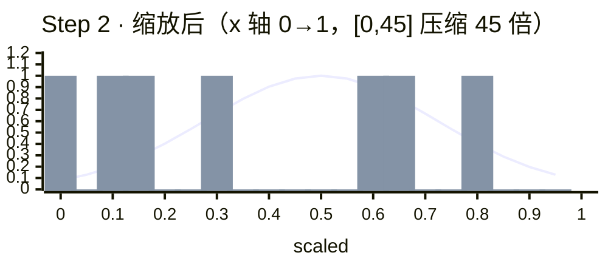

# 归一化 Min-Max Normalization

> ★ 掌握级别

## 底稿

> 【掌握】归一化

通过对原始数据进行变换把数据映射到【 0~1 】之间。

数据归一化的 API 实现：

```python
sklearn.preprocessing.MinMaxScaler(feature_range=(0,1)…)
```

```python
'''
演示  特征预处理之归一化
    特征预处理解释：
        背景：
            在实际开发中，如果多个特征列因为量纲（单位）的问题，导致数值的差距过大。
            则会导致模型预测值偏差。
            为了保证每个列对最终的预测结果的权重比都是相近的。
            所以我们需要对特征预处理操作。
        特征预处理实现方式：
            1：归一化（现在）
            2：标准化
        归一化介绍：
            概述：它是特征预处理一种方案。
                对原始数据进行处理，获取 1 个，默认 [mi, mx] 【0, 1】区间值
            公式：(min max 列的    mx mi 区间的)
                x' = (x - min) / (max - min)
                x'' = x' * (mx - mi) + mi
            公式解释：
                x   → 某一个特征列的值：原值
                min → 该特征列的最小值
                max → 该特征列的最大值
                mi  → 区间的最小值默认 0
                mx  → 区间的最大值默认 1
            弊端：
                强依赖于该列的特征 最大值和最小值，如果差值比较大的话，计算效果不明显
                归一化适用于小数据集 的特征预处理。
'''

# 导包
from sklearn.preprocessing import MinMaxScaler

# 准备数据
data = [[90, 2, 10, 40],
        [60, 4, 15, 45],
        [75, 3, 13, 46]]

# 初始化 归一化器
transform = MinMaxScaler()
# 开始转换
# 方法 fit + transform    fit: 计算每一列的最小值和最大值    transform: 对数据进行归一化
data = transform.fit_transform(data)

print(data)
```

- `feature_range`：缩放区间
- 调用 `fit_transform(X)` 将特征进行归一化缩放

归一化受到最大值与最小值的影响，这种方法容易受到异常数据的影响，鲁棒性较差，适合传统精确小数据场景。

---

## 直觉

把每个特征拉到同一把尺子上（统一区间，最简单是 `[0, 1]`），让 KNN 算距离时**各特征公平贡献**，不被某个量纲大的特征独裁。

> 类比：考试折算 —— 数学满分 150、语文满分 120、英语满分 100。要"平等比较"得先把每科都折算到 100 分制。归一化就是数据版的"折算总分"。

### 几何本质：平移 + 缩放两步走

Min-Max 公式 $x' = \frac{x - \min}{\max - \min}$ 看着是一个除法，其实是**两个动作的叠加**：

以健康案例（[01·案例二](./01-为什么预处理.md#案例二--健康预测业务场景)）的体重列为例：

| 原始 (kg) | 65 | 70 | 72 | 78 | 92 | 95 | 100 | 110 |
|---|---|---|---|---|---|---|---|---|
| 平移后 (−65) | 0 | 5 | 7 | 13 | 27 | 30 | 35 | 45 |
| 缩放后 (÷ 45) | 0 | 0.111 | 0.156 | 0.289 | 0.600 | 0.667 | 0.778 | 1.0 |

min=65, max=110, max−min=45。

**Step 1 · 平移（translate）**：每个值减去 `min = 65`

x 轴固定 `0 → 110`，**钟形曲线 + 离散样本点**双重叠加（原始在右、平移后在左）→ 看到分布**整体左移 65**，曲线形状完全一致：

```mermaid
---
config:
  xyChart:
    width: 500
    height: 220
---
xychart-beta
    title "Step 1 · 平移：分布左移 65（x 轴 0→110）"
    x-axis "weight" 0 --> 110
    y-axis "" 0 --> 1.2
    line [0.08,0.099,0.122,0.149,0.181,0.216,0.256,0.301,0.35,0.402,0.458,0.516,0.576,0.637,0.697,0.755,0.81,0.86,0.904,0.941,0.969,0.989,0.999,0.999,0.989,0.969,0.941,0.904,0.86,0.81,0.755,0.697,0.637,0.576,0.516,0.458,0.402,0.35,0.301,0.256,0.216,0.181,0.149,0.122,0.099,0.08,0.063,0.05,0.039,0.03,0.023,0.017,0.013,0.01,0.007,0.005,0.004,0.003,0.002,0.001,0.001,0.001,0,0,0,0,0,0,0,0,0,0,0,0,0,0,0,0,0,0,0,0,0,0,0,0,0,0,0,0,0,0,0,0,0,0,0,0,0,0,0,0,0,0,0,0,0,0,0,0,0,0,0,0,0,0,0,0,0,0,0]
    line [0,0,0,0,0,0,0,0,0,0,0,0,0,0,0,0,0,0,0,0,0,0,0,0,0,0,0,0,0,0,0,0,0,0,0,0,0,0,0,0,0,0,0,0,0,0,0,0,0,0.001,0.001,0.001,0.002,0.003,0.004,0.005,0.007,0.01,0.013,0.017,0.023,0.03,0.039,0.05,0.063,0.08,0.099,0.122,0.149,0.181,0.216,0.256,0.301,0.35,0.402,0.458,0.516,0.576,0.637,0.697,0.755,0.81,0.86,0.904,0.941,0.969,0.989,0.999,0.999,0.989,0.969,0.941,0.904,0.86,0.81,0.755,0.697,0.637,0.576,0.516,0.458,0.402,0.35,0.301,0.256,0.216,0.181,0.149,0.122,0.099,0.08]
    bar [1,0,0,0,0,1,0,1,0,0,0,0,0,1,0,0,0,0,0,0,0,0,0,0,0,0,0,1,0,0,1,0,0,0,0,1,0,0,0,0,0,0,0,0,0,1,0,0,0,0,0,0,0,0,0,0,0,0,0,0,0,0,0,0,0,0,0,0,0,0,0,0,0,0,0,0,0,0,0,0,0,0,0,0,0,0,0,0,0,0,0,0,0,0,0,0,0,0,0,0,0,0,0,0,0,0,0,0,0,0,0]
    bar [0,0,0,0,0,0,0,0,0,0,0,0,0,0,0,0,0,0,0,0,0,0,0,0,0,0,0,0,0,0,0,0,0,0,0,0,0,0,0,0,0,0,0,0,0,0,0,0,0,0,0,0,0,0,0,0,0,0,0,0,0,0,0,0,0,1,0,0,0,0,1,0,1,0,0,0,0,0,1,0,0,0,0,0,0,0,0,0,0,0,0,0,1,0,0,1,0,0,0,0,1,0,0,0,0,0,0,0,0,0,1]
```



→ 区间 `[65, 110]` → `[0, 45]`。**只动起点，不改跨度**——曲线形状和样本相对位置完全没变。

**Step 2 · 缩放（scale）**：每个值除以 `(max − min) = 45`

x 轴切到 `0 → 1`（**x 跨度从 110 → 1，等于 45 倍视觉放大**），看到平移后的钟形被压缩到 [0, 1]：



→ 区间 `[0, 45]` → `[0, 1]`。**只压跨度，不动起点**（0 ÷ 任何数仍是 0）。

**关键性质**：对比 Step 1 中"平移后"的点（0, 5, 7, 13, 27, 30, 35, 45）与 Step 2 的点（0, 0.111, 0.156, 0.289, 0.6, 0.667, 0.778, 1.0）—— **相邻样本的距离比例完全保留**：

- 平移后 5 → 7 的距离 = 2，占总跨度 2/45 ≈ 4.4%
- 缩放后 0.111 → 0.156 的距离 = 0.045，占总跨度 0.045/1 = 4.5% ✓

→ 这就是线性变换的核心性质：**样本间相对距离比例不变**。这正是 KNN 距离能在缩放后保持公平的根基。

### 为什么这两步缺一不可

| 只做平移不缩放 | 只做缩放不平移 |
|---|---|
| 起点对齐了，但跨度还是 45 | 起点没对齐（除完仍是 `[1.44, 2.44]`） |
| 体重 vs 视力跨度依旧悬殊 | 数值范围还是不在 `[0, 1]` |

**先对齐起点，再统一尺度**——两步配合才能把任意区间映射到 `[0, 1]`。

---

## 数学方法：Min-Max 公式

$$x' = \frac{x - \min(x)}{\max(x) - \min(x)}$$

→ 分子 = 平移，分母 = 缩放因子。每列最小值 → 0、最大值 → 1，其他线性插值到 `[0, 1]`。

→ 业务案例（身高 / 体重 / 视力 → 健康预测）见 [`01-为什么预处理 · 案例二`](./01-为什么预处理.md#案例二--健康预测业务场景)。

---

## 代码落地：sklearn 集成 KNN

```python
from sklearn.preprocessing import MinMaxScaler
from sklearn.neighbors import KNeighborsClassifier

# 1. 缩放训练数据
scaler = MinMaxScaler(feature_range=(0, 1))   # 默认 [0, 1]
X_scaled = scaler.fit_transform(X)

# 2. KNN 用缩放后的数据训练
model = KNeighborsClassifier(n_neighbors=3)
model.fit(X_scaled, y)

# 3. 预测新人健康（注意：新数据也要用同一个 scaler 缩放）
new_person = [[173, 80, 1.0]]   # 身高 / 体重 / 视力
prediction = model.predict(scaler.transform(new_person))
print(prediction)   # 输出: [1] 健康  或  [2] 不健康
```

---

## 局限：KNN 受异常值影响

如果数据混入异常值（比如录错体重 250kg）：

| 体重 (kg) | 65 | 70 | 72 | 78 | 92 | 95 | 100 | 110 | **250** ← 异常 |
|---|---|---|---|---|---|---|---|---|---|
| 归一化 (÷ 185) | 0 | 0.027 | 0.038 | 0.070 | 0.146 | 0.162 | 0.189 | 0.243 | **1.0** |

min=65, max=**250**（被异常值拉爆），range=185。

**原始分布（x 轴 0→260）**：8 个正常样本 + 1 个孤立异常值

```mermaid
---
config:
  xyChart:
    width: 500
    height: 220
---
xychart-beta
    title "原始：正常聚集 65-110 + 异常值 250"
    x-axis "weight" 0 --> 260
    y-axis "" 0 --> 1.2
    line [0,0,0,0,0,0,0,0,0,0,0,0,0,0,0,0,0,0,0,0,0,0,0,0,0,0,0,0,0,0,0,0,0,0,0,0,0,0,0,0,0,0,0,0,0,0,0,0,0,0.001,0.001,0.001,0.002,0.003,0.004,0.005,0.007,0.01,0.013,0.017,0.023,0.03,0.039,0.05,0.063,0.08,0.099,0.122,0.149,0.181,0.216,0.256,0.301,0.35,0.402,0.458,0.516,0.576,0.637,0.697,0.755,0.81,0.86,0.904,0.941,0.969,0.989,0.999,0.999,0.989,0.969,0.941,0.904,0.86,0.81,0.755,0.697,0.637,0.576,0.516,0.458,0.402,0.35,0.301,0.256,0.216,0.181,0.149,0.122,0.099,0.08,0.063,0.05,0.039,0.03,0.023,0.017,0.013,0.01,0.007,0.005,0.004,0.003,0.002,0.001,0.001,0.001,0,0,0,0,0,0,0,0,0,0,0,0,0,0,0,0,0,0,0,0,0,0,0,0,0,0,0,0,0,0,0,0,0,0,0,0,0,0,0,0,0,0,0,0,0,0,0,0,0,0,0,0,0,0,0,0,0,0,0,0,0,0,0,0,0,0,0,0,0,0,0,0,0,0,0,0,0,0,0,0,0,0,0,0,0,0,0,0,0,0,0,0,0,0,0,0,0,0,0,0,0,0,0,0,0,0,0,0,0,0,0,0,0,0,0,0,0,0,0,0,0,0,0,0,0,0,0,0,0,0,0,0,0,0,0,0,0,0,0,0,0,0,0,0,0,0,0,0,0,0,0]
    bar [0,0,0,0,0,0,0,0,0,0,0,0,0,0,0,0,0,0,0,0,0,0,0,0,0,0,0,0,0,0,0,0,0,0,0,0,0,0,0,0,0,0,0,0,0,0,0,0,0,0,0,0,0,0,0,0,0,0,0,0,0,0,0,0,0,1,0,0,0,0,1,0,1,0,0,0,0,0,1,0,0,0,0,0,0,0,0,0,0,0,0,0,1,0,0,1,0,0,0,0,1,0,0,0,0,0,0,0,0,0,1,0,0,0,0,0,0,0,0,0,0,0,0,0,0,0,0,0,0,0,0,0,0,0,0,0,0,0,0,0,0,0,0,0,0,0,0,0,0,0,0,0,0,0,0,0,0,0,0,0,0,0,0,0,0,0,0,0,0,0,0,0,0,0,0,0,0,0,0,0,0,0,0,0,0,0,0,0,0,0,0,0,0,0,0,0,0,0,0,0,0,0,0,0,0,0,0,0,0,0,0,0,0,0,0,0,0,0,0,0,0,0,0,0,0,0,0,0,0,0,0,0,0,0,0,0,0,0,0,0,0,0,0,0,0,0,0,0,0,0,0,0,0,0,0]
    bar [0,0,0,0,0,0,0,0,0,0,0,0,0,0,0,0,0,0,0,0,0,0,0,0,0,0,0,0,0,0,0,0,0,0,0,0,0,0,0,0,0,0,0,0,0,0,0,0,0,0,0,0,0,0,0,0,0,0,0,0,0,0,0,0,0,0,0,0,0,0,0,0,0,0,0,0,0,0,0,0,0,0,0,0,0,0,0,0,0,0,0,0,0,0,0,0,0,0,0,0,0,0,0,0,0,0,0,0,0,0,0,0,0,0,0,0,0,0,0,0,0,0,0,0,0,0,0,0,0,0,0,0,0,0,0,0,0,0,0,0,0,0,0,0,0,0,0,0,0,0,0,0,0,0,0,0,0,0,0,0,0,0,0,0,0,0,0,0,0,0,0,0,0,0,0,0,0,0,0,0,0,0,0,0,0,0,0,0,0,0,0,0,0,0,0,0,0,0,0,0,0,0,0,0,0,0,0,0,0,0,0,0,0,0,0,0,0,0,0,0,0,0,0,0,0,0,0,0,0,0,0,0,0,0,0,0,0,0,0,0,0,0,0,0,0,0,0,0,0,0,1,0,0,0,0,0,0,0,0,0,0]
```



**归一化后（x 轴 0→1）**：min=65 / max=250，正常聚集被压到 [0, 0.243]，异常值在 1.0

```mermaid
---
config:
  xyChart:
    width: 500
    height: 220
---
xychart-beta
    title "归一化后：正常区被压到 [0, 0.24]，丢失区分度"
    x-axis "scaled" 0 --> 1
    y-axis "" 0 --> 1.2
    line [0.078,0.168,0.316,0.517,0.739,0.92,0.999,0.946,0.781,0.562,0.352,0.193,0.092,0.038,0.014,0.004,0.001,0,0,0,0,0,0,0,0,0,0,0,0,0,0,0,0,0,0,0,0,0,0,0,0,0,0,0,0,0,0,0,0,0,0]
    bar [1,1,1,0,1,0,0,1,1,1,0,0,1,0,0,0,0,0,0,0,0,0,0,0,0,0,0,0,0,0,0,0,0,0,0,0,0,0,0,0,0,0,0,0,0,0,0,0,0,0,0]
    bar [0,0,0,0,0,0,0,0,0,0,0,0,0,0,0,0,0,0,0,0,0,0,0,0,0,0,0,0,0,0,0,0,0,0,0,0,0,0,0,0,0,0,0,0,0,0,0,0,0,0,1]
```



→ 异常值绑架了缩放结果。**KNN 找邻居时**：原本在体重轴上能区分的 8 个样本，现在全部挤在 [0, 0.24] 区间，距离差异被放大的异常值碾压——区分度大幅下降。

---

## 关键启示

| 维度 | 归一化 |
|---|---|
| 优点 | 严格 [0, 1]，KNN 距离公平 |
| 缺点 | 异常值绑架，KNN 区分度被压缩 |
| 适用 | 传统精确小数据场景 |

嘈杂大数据场景用标准化（[下一节](./03-标准化.md)）。

---

## Sources（国际教学参考）

- [scikit-learn · Importance of Feature Scaling](https://scikit-learn.org/stable/auto_examples/preprocessing/plot_scaling_importance.html)
- [Feature Scaling in Machine Learning](https://howtolearnmachinelearning.com/articles/feature-scaling-in-machine-learning/) — 经典身高（1.51-1.97m）+ 体重（48-110kg）KNN 量纲问题 demo
- [GeeksforGeeks · Feature Engineering — Scaling, Normalization and Standardization](https://www.geeksforgeeks.org/machine-learning/feature-engineering-scaling-normalization-and-standardization/)
