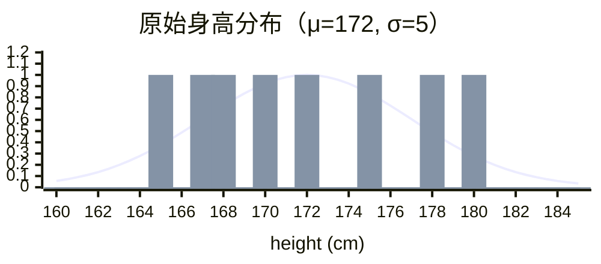
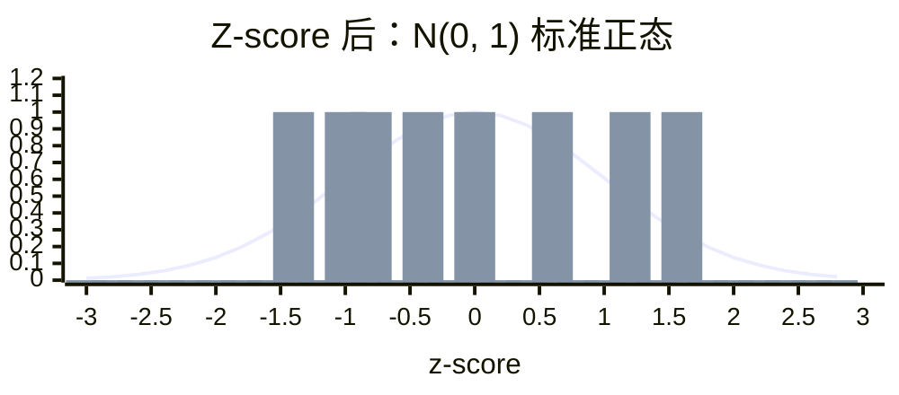

# 标准化 Z-score Standardization

> ★ 掌握级别

## 底稿

> 【掌握】标准化

通过对原始数据进行标准化，转换为【 均值=0，标准差=1 】的标准正态分布的数据。

- mean → 【 均值 】
- σ → 为特征的【 标准差 】

数据标准化的 API 实现：

```python
sklearn.preprocessing.StandardScaler()
```

调用 `fit_transform(X)` 将特征进行归一化缩放。

```python
'''
标准化介绍
    概述：特征预处理一种方案
    公式：x' = (x - 该列的平均值) / 该列的标准差
    公式解释：
        x    → 某特征列的某个具体的值 即原值
        mean → 该列的平均值
    应用场景：比较合适大数据集的应用场景。当数据量比较大的时候
        受最大值和最小值的影响会微乎其微。
    总结：
        无论是归一化，还是标准化，目的都是避免因为特征列的量纲问题，导致权重不同
        从而影响预测结果

    与 MinMaxScaler 的关键区别：
        - MinMaxScaler：缩放到固定范围（如 [0, 1]），对异常值敏感
        - StandardScaler：基于统计分布（均值/标准差），对异常值相对鲁棒
'''

from sklearn.preprocessing import StandardScaler

# 准备数据
data = [[90, 2, 10, 40],
        [60, 4, 15, 45],
        [75, 3, 13, 46]]

# 初始化 归一化器
transform = StandardScaler()
# 开始转换
# 方法 fit + transform    fit: 计算每一列的最小值和最大值    transform: 对数据进行归一化
data = transform.fit_transform(data)

print(data)

print('均值', transform.mean_)
print('方差', transform.var_)
```

对于标准化来说，如果出现异常点，由于具有一定数据量，少量的异常点对于平均值的影响并不大。

### 高斯分布

正态分布是一种概率分布，大自然很多数据或者特征符合正态分布，也叫高斯分布。

正态分布记作 N(μ, σ)：μ 决定了其位置，其标准差 σ 决定了分布的幅度。

当 μ=0、σ=1 时的正态分布是标准正态分布。

方差。

3σ 法则的实例。

---

## 直觉

把每个特征"中心化" —— **减去均值、除以标准差**，让数据围绕 0 分布，大部分点落在 `[-3, 3]`。

> 类比：考试成绩转换为"高于平均几个 σ" —— 你比平均高 1.5σ（意味着你比 93% 的人强），无视绝对分数，只看相对位置。

---

## 业务问题：KNN 嘈杂数据下 Min-Max 不够

延续 [01-为什么](./01-为什么预处理.md) —— KNN 距离被时长 / 体重等大量纲特征支配。

归一化（[上节](./02-归一化.md)）已经能解决，**但归一化对异常值敏感** —— 一个错误数据就会绑架整列（min/max 被拉偏）。现实中数据嘈杂、异常值常有，这时归一化失效。

**标准化解法**：用 **均值 / 标准差** 代替 **min / max**。少数异常值不会大幅改变均值和标准差，所以 **KNN 在嘈杂数据下更稳**。

---

## 数学方法：Z-score 公式

$$x' = \frac{x - \mu}{\sigma}$$

- $\mu$（mu）：该特征列的均值
- $\sigma$（sigma）：该特征列的标准差

→ 减去均值再除以标准差，得到 **均值 0、标准差 1** 的新分布。

### 中心化 + 缩放：可视化

延续 [01·案例二](./01-为什么预处理.md#案例二--健康预测业务场景) 的 8 个身高样本（cm）：

| 原始 | 165 | 167 | 168 | 170 | 172 | 175 | 178 | 180 |
|---|---|---|---|---|---|---|---|---|
| Z-score | −1.4 | −1.0 | −0.8 | −0.4 | 0 | 0.6 | 1.2 | 1.6 |

均值 $\mu = 172$，标准差 $\sigma = 5$（实算 σ≈5.04，圆整）。

**原始分布（x 轴 160→185）**：钟形中心 172，σ=5



**标准化后（x 轴 −3→3）**：中心移到 0，σ 压成 1（标准正态 $N(0,1)$）



→ 钟形形状保留，**位置 + 幅度**两步同时变换：
- 减 μ：曲线左移到 0 居中（中心化）
- 除 σ：曲线被压到 σ=1（缩放）

### 实算

- 175 → (175 − 172) / 5 = **0.6**（高于均值 0.6 个 σ）
- 165 → (165 − 172) / 5 = **−1.4**（低于均值 1.4 个 σ）

体重 / 视力同样处理 → 三个特征都围绕 0，KNN 距离贡献对等。

### 理论基础：高斯分布

Z-score 标准化的本质 = **把任意（近似正态的）分布转成标准正态 $N(0, 1)$**。

→ 详见 [`04-高斯分布`](./04-高斯分布.md)（$N(\mu, \sigma)$ 记号 / 3σ 法则 / 为什么 KNN 鲁棒的根因）。

---

## 代码落地：sklearn 集成 KNN

```python
from sklearn.preprocessing import StandardScaler
from sklearn.neighbors import KNeighborsClassifier

# 1. 缩放训练数据
scaler = StandardScaler()
X_scaled = scaler.fit_transform(X)

# 2. KNN 用缩放后的数据训练
model = KNeighborsClassifier(n_neighbors=3)
model.fit(X_scaled, y)

# 3. 预测新人健康（用同一个 scaler 缩放）
new_person = [[173, 80, 1.0]]   # 身高 / 体重 / 视力
prediction = model.predict(scaler.transform(new_person))
print(prediction)   # 输出: [1] 健康  或  [2] 不健康
```

---

## 与归一化对比（KNN 视角）

| 维度 | 归一化 Min-Max | 标准化 Z-score |
|---|---|---|
| 公式 | $(x - \min) / (\max - \min)$ | $(x - \mu) / \sigma$ |
| 用什么缩放 | 最大值 / 最小值 | 均值 / 标准差 |
| 输出范围 | 严格 $[0, 1]$ | 不固定（常见 $[-3, 3]$） |
| 异常值场景 | 被绑架 → KNN 区分度下降 | 较稳 → KNN 受影响小 |
| KNN 适用 | 干净小数据 | **嘈杂大数据**（首选） |

---

## 关键启示

- 现代 KNN 实战 **首选标准化**（PPT 原话："以后就是用你了"）
- 异常值多 / 数据嘈杂 → 标准化更稳
- 需要严格 $[0, 1]$ 范围（如图像像素）→ 归一化

---

## Sources

- [scikit-learn · StandardScaler](https://scikit-learn.org/stable/modules/generated/sklearn.preprocessing.StandardScaler.html)
- [scikit-learn · Importance of Feature Scaling](https://scikit-learn.org/stable/auto_examples/preprocessing/plot_scaling_importance.html)
- [Feature Scaling Techniques in Python](https://www.analyticsvidhya.com/blog/2021/05/feature-scaling-techniques-in-python-a-complete-guide/)
