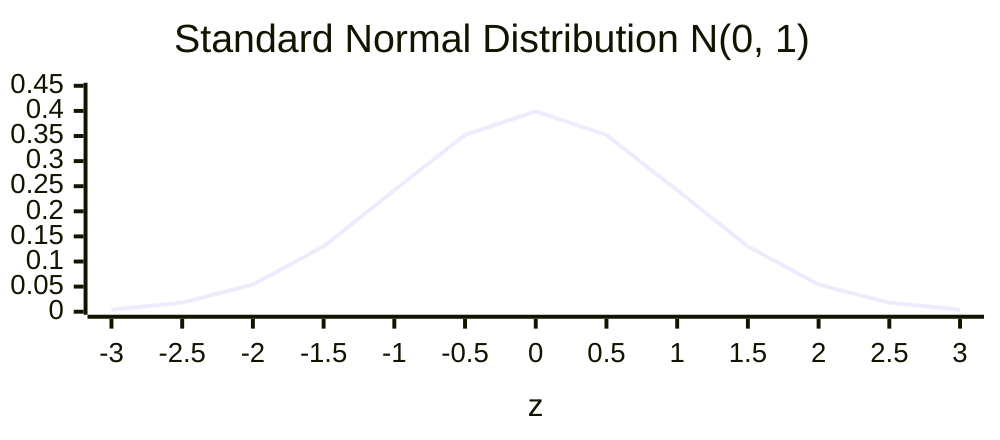
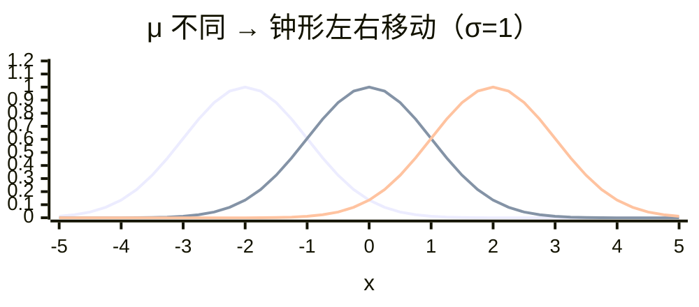
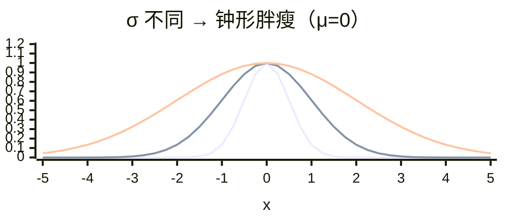

# 高斯分布 Gaussian Distribution

> ★ 掌握级别 · 标准化的理论基础

## 底稿

> 高斯分布

正态分布是一种概率分布，大自然很多数据或者特征符合正态分布，也叫高斯分布。

正态分布记作 N(μ, σ)：μ 决定了其位置，其标准差 σ 决定了分布的幅度。

当 μ=0、σ=1 时的正态分布是标准正态分布。

方差 / 3σ 法则的实例。

---

## 直觉：为什么"钟形"是自然形态

身高、考试成绩、测量误差、零件尺寸…… 这些数据画直方图都长成**中间高两边低的钟形**：

- 大部分人聚集在平均值附近（"普通"）
- 极端值（特别高 / 特别矮）越来越少
- 左右大致对称

→ 这就是正态分布的形状。**中心极限定理**告诉我们：大量独立随机因素叠加的结果，趋向正态分布——所以现实数据里它无处不在。

---

## 数学方法：$N(\mu, \sigma)$ 记号

正态分布由两个参数完全决定：

| 参数 | 符号 | 控制 | 直觉 |
|---|---|---|---|
| 均值 | $\mu$（mu） | **位置** | 钟形中心在哪 |
| 标准差 | $\sigma$（sigma） | **幅度** | 钟形胖瘦（σ 大 → 矮胖 / σ 小 → 高瘦） |

记作 $X \sim N(\mu, \sigma)$，读作"X 服从均值 μ、标准差 σ 的正态分布"。

### 标准正态分布 $N(0, 1)$

当 $\mu = 0$、$\sigma = 1$ 时叫**标准正态分布**——所有正态分布的"基准形态"。



→ 中心在 0，最高点密度 ≈ 0.399，3σ 之外几乎归零。

### μ 控制位置：左右平移

固定 $\sigma = 1$，对比 $N(-2,1)$ / $N(0,1)$ / $N(2,1)$：



→ 三条曲线**形状完全相同**，只是中心从 −2 → 0 → 2。**μ 是位置参数，不影响胖瘦**。

### σ 控制胖瘦：高瘦 vs 矮胖

固定 $\mu = 0$，对比 $N(0, 0.5)$ / $N(0, 1)$ / $N(0, 2)$：



→ σ 越小越**高瘦**（数据集中），σ 越大越**矮胖**（数据离散）。**σ 是尺度参数，决定数据的"扩散程度"**。

> 注：图中三条曲线峰值都标到 1.0 是为了视觉对比；真实概率密度函数中，σ 越小峰值越高（积分恒为 1）。

---

## 68 - 95 - 99.7 法则（3σ 法则）

钟形曲线下的面积 = 数据落在该区间的概率：

| 区间 | 占比 | 含义 |
|---|---|---|
| $[\mu - \sigma,\ \mu + \sigma]$ | **68%** | 大部分数据 |
| $[\mu - 2\sigma,\ \mu + 2\sigma]$ | **95%** | 几乎所有正常数据 |
| $[\mu - 3\sigma,\ \mu + 3\sigma]$ | **99.7%** | 3σ 之外 → 异常点 |

**应用**：质量检测、异常检测、A/B 测试显著性判断都依赖这套法则。

### 实例

工厂生产某零件长度服从 $N(10\,\text{mm},\ 0.1\,\text{mm})$：

- 99.7% 的零件在 $[9.7, 10.3]$ mm 内
- 测出 10.5 mm 的（5σ 之外）→ 视为异常，触发质检

---

## 与 Z-score 的关系

Z-score 标准化：

$$x' = \frac{x - \mu}{\sigma}$$

**几何含义**：把任意正态分布 $N(\mu, \sigma)$ **平移 + 缩放**到标准正态 $N(0, 1)$。

```
原始: X ~ N(173, 5.5)        标准化: Z ~ N(0, 1)
        身高分布                     标准正态
       钟形中心 173                  钟形中心 0
       σ = 5.5                      σ = 1
            │
            ↓ Z = (X − 173) / 5.5
```

→ 标准化的输出值含义：**"距离均值多少个 σ"**。
- $z = 1.5$ → 比平均高 1.5 个标准差（约 93% 的人之上）
- $z = -2$ → 比平均低 2 个标准差（约 2.3% 的人之下）

---

## 回扣 KNN：为什么标准化在嘈杂数据下鲁棒

核心机制：**异常值在正态分布下数量级极少（<0.3%）**——

- $\mu$（均值）由全部数据决定，少数异常值不足以撼动
- $\sigma$（标准差）反映整体离散程度，几个异常值贡献有限

→ 缩放参数（$\mu$ / $\sigma$）稳定 → 标准化后的结果稳定 → KNN 找邻居时正常数据区分度不被绑架。

对比归一化：min/max 由**单点决定**（边界点），1 个异常值就能拉飞整个区间。这就是 [`02-归一化`](./02-归一化.md#局限knn-受异常值影响) 那张"被压到 [0, 0.24]"图的来源。

---

## 不在本章范围

- **正态分布 PDF 公式**：$f(x) = \frac{1}{\sigma\sqrt{2\pi}} e^{-\frac{(x-\mu)^2}{2\sigma^2}}$ —— 统计学主场
- **中心极限定理推导** —— 概率论主场
- **多元正态分布 / 协方差矩阵** —— 后续章节遇到时再展开

这里只用"$\mu$ / $\sigma$ + 3σ 法则"这一组工具支撑标准化。

---

## Sources

- [Wikipedia · Normal Distribution](https://en.wikipedia.org/wiki/Normal_distribution)
- [Khan Academy · Empirical Rule (68-95-99.7)](https://www.khanacademy.org/math/statistics-probability/modeling-distributions-of-data/normal-distributions-library/v/ck12-org-normal-distribution-problems-empirical-rule)
- [scikit-learn · StandardScaler](https://scikit-learn.org/stable/modules/generated/sklearn.preprocessing.StandardScaler.html)
